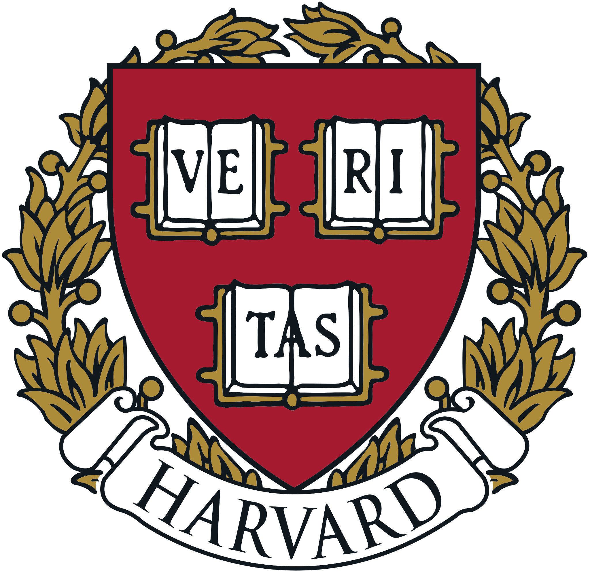
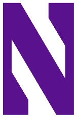
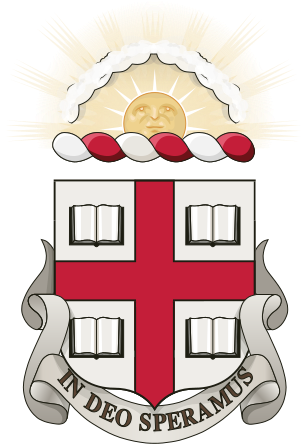

<p align="center">
  
</p>

<p align="center">
  <sub><a href="https://aximon.ai/">husky</a> · <a href="https://www.yurii.blog/">writing</a> · <a href="https://www.linkedin.com/in/yurii-tovarnytskyi/">linkedin</a> · <a href="mailto:yurii@aximon.ai">email</a></sub>
</p>

<br/>

```
$ cat skills.txt
```

<p align="center">
  
</p>

<p align="center">
  <sub>ai/ml: llm pipelines · rag · agents · evals · on-device inference (whisper, runanywhere) · claude + openai apis</sub><br/>
  <sub>design: product design · design systems · brand · motion · figma → code</sub>
</p>

<br/>

```
$ tail experience.log
```

| | | |
| --- | --- | --- |
| `2026 → now` | **cto · [husky](https://aximon.ai/)** | underwriting ai for cre teams · $60k contracted in 5 weeks · backed by an a16z scout · antler s26 |
| `2026` | **founder in residence · antler s26** | san francisco · ~2% acceptance · pivoted protege → husky |
| `2026` | **ceo · protege** | ai coding mentor that lives in your editor · 1.6k downloads · sh1p s26 |
| `2026` | **design engineer · runanywhere (yc w26)** | on-device ai infrastructure · shipped pitchperfect on their sdk |
| `2026` | **cto · nymble** | early-stage build |
| `2025` | **cto · stealth startup** | brno · 2,000 hours · walked away when the bar stopped rising |
| `2025` | **software engineer · feedyou** | solo-shipped a $22k ai support agent · #1 microsoft ai 2019 |
| `2025` | **design engineer · cuub** | largest power-bank rental network in illinois · raised $270k+ |
| `2025` | **design engineer · highlight (nyc)** | disney, airbnb, american express, johnson & johnson, deloitte |
| `2022 → 2024` | **design engineer · udox** | 2 years · where it started |

<br/>

```
$ ls ~/builds
```

| | |
| --- | --- |
| [`planneeer/`](https://github.com/z1ros/planneeer) | hack@brown 2026 winner · ai nyc adventure planning |
| [`pitchperfect/`](https://github.com/z1ros/runanywhere-pitch-coach) | fully on-device speech transcription and pitch coaching |
| [`nori/`](https://github.com/z1ros/nori) | portable financial trust profiles for immigrants entering the us |
| [`tatra-capital/`](https://github.com/z1ros/tatracapitalgroup) | production platform for a central european investment group |

<br/>

```
$ ls ~/hackathons
```

<table align="center">
  <tr align="center">
    <td width="16%"><a href="https://hackharvard.io/"></a><br/><sub>hackharvard<br/>judge</sub></td>
    <td width="16%"><a href="https://hackillinois.org/"></a><br/><sub>hackillinois<br/>judge</sub></td>
    <td width="16%"><a href="https://lahacks.com/"></a><br/><sub>la hacks<br/>judge</sub></td>
    <td width="16%"><a href="https://wildhacks.net/"></a><br/><sub>wildhacks<br/>judge &amp; mentor</sub></td>
    <td width="16%"><a href="https://www.uncommonhacks.com/"></a><br/><sub>uncommonhacks<br/>judge</sub></td>
    <td width="16%"><a href="https://www.hackatbrown.org/"></a><br/><sub>hack@brown<br/>1st place</sub></td>
  </tr>
</table>

<p align="center"><sub>also 1st at the uchicago hackathon and the northwestern competition, may 2026. 4 wins, 5 judged.</sub></p>

<details>
  <summary><code>$ cat story.txt</code></summary>
  <br/>
  <sub>grew up in a small village in ukraine and started building websites as a teenager. dropped out of the best engineering high school in czechia, bounced between top prague agencies, spent 2,000 hours as a cto, went from english a1 to c1 in 9 months, and landed in chicago with $5k. joined runanywhere (yc w26), started protege, got into antler s26, pivoted to husky. four countries, roles across design, engineering, cto, and founder, and enough failed companies to stop romanticizing ideas. i care about useful software, speed, and getting the work into people's hands.</sub>
</details>

<br/>

<p align="center">
  <sub>outwork. outsmart. outlast.</sub>
</p>
