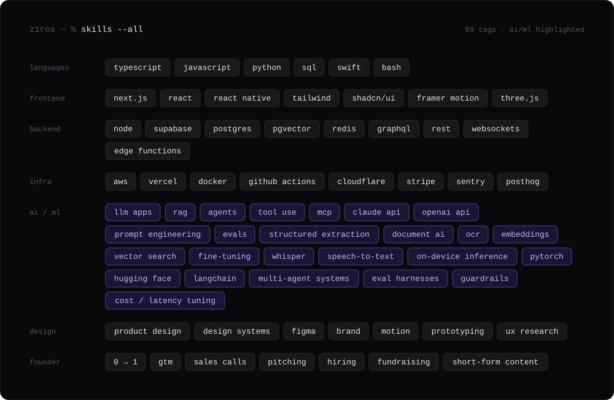
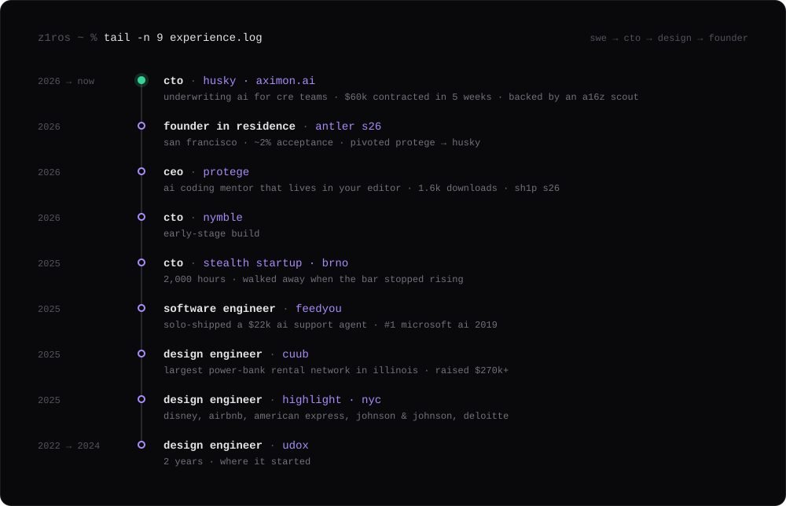
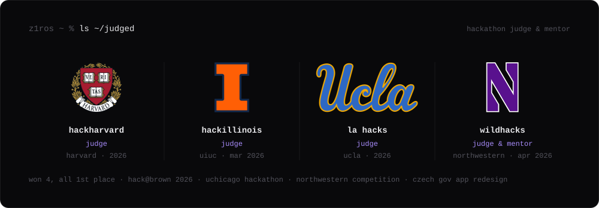

  

  <a href="https://aximon.ai/">husky</a> · <a href="https://www.yurii.blog/">writing</a> · <a href="https://www.linkedin.com/in/yurii-tovarnytskyi/">linkedin</a> · <a href="mailto:yurii@aximon.ai">email</a>

  

  

  

 

  outwork. outsmart. outlast.

