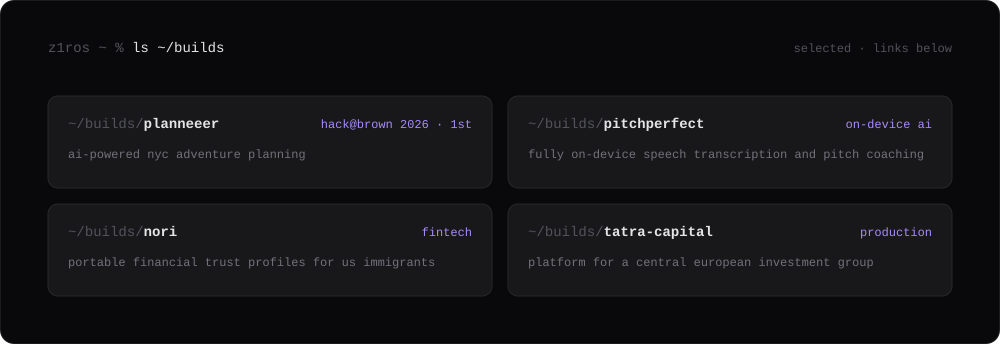

  

  <a href="https://aximon.ai/">husky</a> · <a href="https://www.yurii.blog/">writing</a> · <a href="https://www.linkedin.com/in/yurii-tovarnytskyi/">linkedin</a> · <a href="mailto:yurii@aximon.ai">email</a>

  

  

  

  

  <a href="https://github.com/z1ros/planneeer">planneeer</a> · <a href="https://github.com/z1ros/runanywhere-pitch-coach">pitchperfect</a> · <a href="https://github.com/z1ros/nori">nori</a> · <a href="https://github.com/z1ros/tatracapitalgroup">tatra capital</a>

  
the longer story

   
  grew up in a small village in ukraine and started building websites as a teenager. dropped out of the best engineering high school in czechia, bounced between top prague agencies, spent 2,000 hours as a cto, went from english a1 to c1 in 9 months, and landed in chicago with $5k. joined runanywhere (yc w26), started protege, got into antler s26, pivoted to husky. four countries, roles across design, engineering, cto, and founder, and enough failed companies to stop romanticizing ideas. i care about useful software, speed, and getting the work into people's hands.

 

  outwork. outsmart. outlast.

