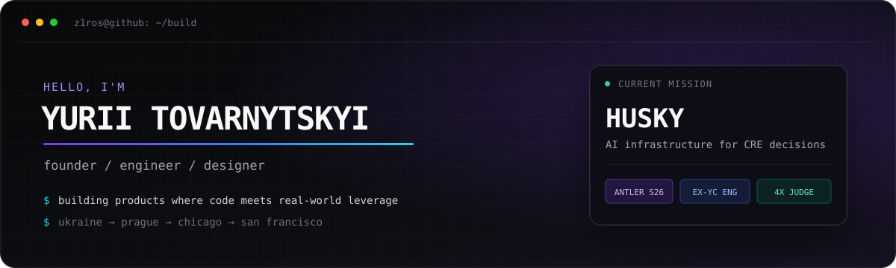
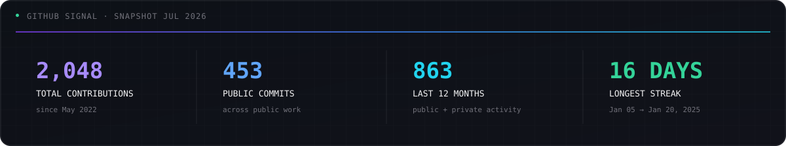

  

  
  
  
  

  
  
  
  

## `> current_mission`

Building **[Husky](https://aximon.ai/)** — underwriting and deal intelligence for commercial real estate teams. Screen every deal, trace every number, and rehearse what happens before the money moves.

<table>
  <tr>
    <td width="50%" valign="top">
      <strong>01 / build</strong>  
      Product, engineering, and design at Husky. 
      AI infrastructure for better CRE decisions.
    </td>
    <td width="50%" valign="top">
      <strong>02 / write</strong>  
      Field notes at <a href="https://www.yurii.blog/">Zero Dev</a>. 
      Startups, engineering, and the road from a Ukrainian village to Silicon Valley.
    </td>
  </tr>
</table>

## `> selected_builds`

| | |
| --- | --- |
| **[Planneeer](https://github.com/z1ros/planneeer)** 🏆 Hack@Brown 2026 winner. AI-powered NYC adventure planning. | **[PitchPerfect](https://github.com/z1ros/runanywhere-pitch-coach)** 🎙️ Fully on-device speech transcription and pitch coaching. |
| **[Nori](https://github.com/z1ros/nori)** 🌎 Portable financial trust profiles for immigrants entering the US. | **[Tatra Capital Group](https://github.com/z1ros/tatracapitalgroup)** 🏢 Production platform for a Central European investment group. |

## `> stack`

  

the stack changes. shipping doesn't.

## `> github_signal`

  

  
<strong>the longer story</strong>

   
  I grew up in a small village in Ukraine and started building websites as a teenager. Since then I've moved through four countries, worked across design, engineering, CTO, and founder roles, shipped products for startups and clients, won hackathons, and failed enough companies to stop romanticizing ideas. I care about useful software, speed, and getting the work into people's hands.

 

  <strong>outwork. outsmart. outlast.</strong> 
  <a href="https://www.yurii.blog/">yurii.blog</a> · <a href="mailto:yurii@aximon.ai">yurii@aximon.ai</a>

